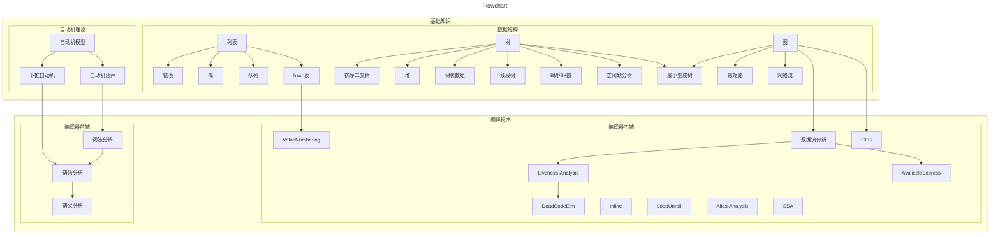

## 学习路线图

本站的知识被分割成单元化的，您可以顺序的系统学习，也可以挑选感兴趣的单元优先学习，但请注意其依赖的前置知识，我们提供了部分教程帮助您快速了解需要的前置知识。

```mermaid {.full-width}
---
title: Flowchart
---
flowchart TB
    subgraph 基础知识
        subgraph 数据结构
            列表 --> 链表
            列表 --> 栈
            列表 --> 队列
            列表 --> hash表
            树 --> 排序二叉树
            树 --> 堆
            树 --> 树状数组
            树 --> 线段树
            树 --> B树/B+数
            树 --> 空间划分树
            树 --> 最小生成树
            图 --> 最小生成树
            图 --> 最短路 
            图 --> 网络流
        end

        subgraph 自动机理论
        自动机模型-->下推自动机
        自动机模型-->自动机合并
        end
    end

    subgraph 编译技术
        subgraph 编译器前端
        词法分析-->语法分析-->语义分析
        end

        subgraph 编译器中端
        数据流分析  --> Liveness-Analysis --> DeadCodeElm
        数据流分析  --> AvaliableExpress

        ValueNumbering
        Inline
        LoopUnroll
        Alias-Analysis
        CFG
        SSA

        end
    end

    自动机合并-->词法分析
    下推自动机-->语法分析
    图 --> 数据流分析
    hash表 --> ValueNumbering
    图  -->  CFG

    click c1 "./编译原理/1.前端/(1)词法分析"
``` 