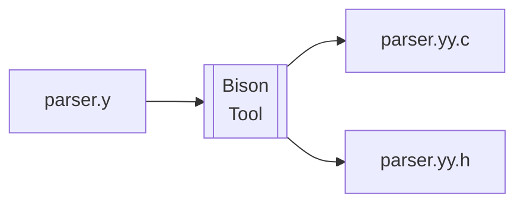

Bison 极速教程
===================

Bison 是一款yacc兼容的解析器生成器，可以将GLR, LR(1), LALR(1) 等上下文无关文法转换为C/C++代码。Bison 是GNU项目的一部分，是自由软件，可以在大多数操作系统上运行。

Bison 的基本工作原理就是一款代码生成器：



Bison 文件分为3个部分，开头的定义，中间的规则，和结尾的用户自定义函数：

```yacc
  // 这里可以放一些定义
%token NUM
%start exp
%%
  // 这里是一系列规则
exp: NUM
%%
  // 这里是用户自定义函数
```

整个文件就会被Bison解析，然后生成一个C文件
