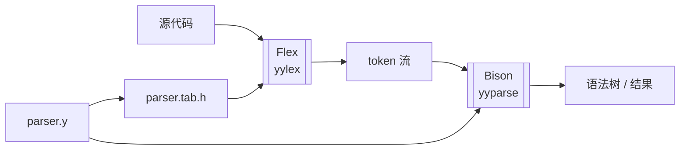

Bison 极速教程
===================

Bison 是一个流行的**语法分析器生成器**。Flex 把源代码切成 token 流，Bison 根据你写的文法规则，判断这些 token 能不能组成合法句子，并在归约时执行动作——比如算出一个表达式结果，或者搭一棵语法树。


```mermaid
flowchart LR
    src[源代码] --> flex[[Flex<br>yylex]] --> tokens[token 流]
    tokens --> bison[[Bison<br>yyparse]] --> ast[语法树 / 结果]
    parser.y --> bison
    parser.y --> header[parser.tab.h]
    header --> flex
```

一句话：**Flex 管“切词”，Bison 管“造句”。**

## 先提醒：Bison 版本差异也不小

Bison 源自 Unix 的 Yacc，但 GNU Bison 3.x 和老大 yacc / 老版 Bison 2.x 在写法上已经有明显代沟：

| 老写法 | 新写法（Bison 3） |
|---|---|
| `%name-prefix="foo"` | `%define api.prefix {foo}` |
| 全局 `yylval`、`yyerror` | `%define api.pure full`（可重入） |
| `%error-verbose` | `%define parse.error detailed` |
| 手写 `extern int yylex()` | `%code requires` / 头文件统一管理 |
| 生成 `y.tab.c` | 默认 `parser.tab.c` + `parser.tab.h` |

**本文按 GNU Bison 3.x 来写。** 先确认版本：

```bash
bison --version
```

如果教程里出现 `y.tab.h`、大量全局变量、或者 `%pure-parser` 这种老指令，别慌——那是旧时代产物。新项目建议直接用 Bison 3 的 `%define` 系列。

## Bison 是什么

Bison **不是**词法分析器，它不会自己读字符。

它默认使用 **LALR(1)** 自底向上分析法：维护一个状态栈，不断从 Flex 拿 token，能移进就移进，能归约就归约，直到整个输入被归约成开始符号。

你可以把 Bison 想成一个**严格但可编程的语法裁判**：

- 你告诉它：合法程序长什么样（产生式）。
- 它一边读 token，一边判断“现在该继续读，还是已经凑够一组可以合并了”。
- 每次归约时，你可以写 C 代码做计算、建 AST、报错误。

## `.y` 文件的三段式结构

和 Flex 类似，Bison 文件也分三块，用 `%%` 隔开：

```bison
/* 第一段：声明区 */
%{
#include <stdio.h>
void yyerror(const char *msg);
%}

%union { double dval; }
%token NUMBER
%left '+' '-'
%%

/* 第二段：文法规则区 */
input: exp { printf("= %f\n", $1); }
     ;

exp: NUMBER { $$ = $1; }
   | exp '+' exp { $$ = $1 + $3; }
   ;

/* 第三段：用户代码区 */
%%
int main(void) {
    yyparse();
    return 0;
}

void yyerror(const char *msg) {
    fprintf(stderr, "错误: %s\n", msg);
}
```

对应关系：

1. **声明区**：C 代码块、`%token`、`%union`、优先级、开始符号等。
2. **文法规则区**：产生式 + 动作。`$1`、`$2` 是右部符号的值，`$$` 是左部归约结果。
3. **用户代码区**：`main`、`yyerror`、辅助函数等。

## 最小可运行示例：计算器

完整示例见仓库：[simple-c/parser.y](https://github.com/sunxfancy/flex-bison-examples/blob/master/simple-c/parser.y)。

`parser.y`（精简版）：

```bison
%{
#include <stdio.h>
#include <stdlib.h>
#include "lexer.h"
void yyerror(const char *msg);
%}

%union { double dval; }

%token MULT DIV PLUS MINUS EQUAL L_PAREN R_PAREN END NUMBER
%left PLUS MINUS
%left MULT DIV
%nonassoc UMINUS

%%
input: /* empty */
     | input line
     ;

line: exp EQUAL END { printf("\t%f\n", $1); }
    ;

exp: NUMBER                     { $$ = $1; }
   | exp PLUS exp               { $$ = $1 + $3; }
   | exp MINUS exp              { $$ = $1 - $3; }
   | exp MULT exp               { $$ = $1 * $3; }
   | exp DIV exp                { if ($3 == 0) yyerror("divide by zero"); else $$ = $1 / $3; }
   | MINUS exp %prec UMINUS     { $$ = -$2; }
   | L_PAREN exp R_PAREN        { $$ = $2; }
   ;
%%

int main(void) {
    yyparse();
    return 0;
}

void yyerror(const char *msg) {
    fprintf(stderr, "** %s\n", msg);
}
```

配套的 `lexer.l` 负责返回 `NUMBER`、`PLUS` 等 token，并通过 `yylval.dval = atof(yytext)` 把数值传给 Bison。细节见 [flex.md](flex.md)。

生成并编译：

```bash
bison -d parser.y          # 生成 parser.tab.c 和 parser.tab.h
flex lexer.l                 # 生成 lex.yy.c
cc -o calc parser.tab.c lex.yy.c -lfl
./calc
```

`-d` 很重要：它会生成头文件，Flex 才能 `#include "parser.tab.h"` 拿到 token 定义。

## 核心概念速查

### `%union` 和 `%token`

不同 token 可能携带不同类型的语义值：

```bison
%union {
    double dval;
    int    ival;
    char  *str;
}

%token <dval> NUMBER
%token <str>  IDENT
%token PLUS MINUS
```

Flex 侧对应写：

```flex
[0-9]+(\.[0-9]+)?  { yylval.dval = atof(yytext); return NUMBER; }
[a-zA-Z_]\w*        { yylval.str = strdup(yytext); return IDENT; }
```

### `$1`、`$2`、`$$`

```bison
exp: exp PLUS exp { $$ = $1 + $3; }
```

- `$1`：第一个 `exp` 的值
- `$3`：第二个 `exp` 的值
- `$$`：当前这条产生式左部 `exp` 的归约结果

Bison 的 `$n` 从**右部第 n 个符号**取值，不是从字符位置取值。

### 优先级与结合性

解决 `1 + 2 * 3` 到底先算谁：

```bison
%left PLUS MINUS
%left MULT DIV
%nonassoc UMINUS
```

- `%left`：左结合，如 `a - b - c` 解析成 `(a - b) - c`
- `%right`：右结合，如赋值 `a = b = c`
- `%nonassoc`：不参与结合，常用于 `UMINUS` 这种一元运算符

一元负号示例：

```bison
| MINUS exp %prec UMINUS { $$ = -$2; }
```

因为 `%nonassoc UMINUS` 的优先级高于 `PLUS`/`MULT`，所以 `-1 * 2` 会先绑定负号。

### `%start` 与 `%type`

```bison
%start program
%type <node> stmt expr
```

- `%start`：指定开始符号，默认是第一个产生式的左部
- `%type`：给非终结符声明语义值类型

## 和 Flex 联用的标准流程

典型编译器前端长这样：

```
lexer.l  ---> flex ---> lex.yy.c
parser.y ---> bison ---> parser.tab.c + parser.tab.h
                              ^
                              |
                         lex.yy.c 引用 parser.tab.h
```

分工：

| 组件 | 负责什么 |
|---|---|
| Flex | 识别 token，`return TOKEN;`，设置 `yylval` |
| Bison | 定义文法，`yyparse()` 驱动分析，归约时建 AST 或执行语义动作 |
| 你的 C 代码 | `main()` 调 `yyparse()`，实现 `yyerror()` |

Flex 里常见写法：

```flex
%{
#include "parser.tab.h"
%}

%%
[0-9]+   { yylval.dval = atof(yytext); return NUMBER; }
"+"      { return PLUS; }
...
%%
```

Bison 里 token 必须声明：

```bison
%token NUMBER PLUS
```

**两边 token 名字必须一致。** Bison 生成头文件，Flex 引用头文件——不要两边各写一套 enum 手工对齐，那是人为制造 bug。

## 错误处理

至少实现一个 `yyerror()`：

```bison
void yyerror(const char *msg) {
    fprintf(stderr, "Line %d: %s\n", yylineno, msg);
}
```

想要更详细的报错，Bison 3 推荐：

```bison
%define parse.error detailed
%locations
```

Flex 侧配合：

```flex
%option yylineno
#define YY_USER_ACTION yylloc.first_line = yylloc.last_line = yylineno;
```

这样语法错误能带上行号，不至于只会说 `syntax error` 让你猜。

## 冲突：移入-归约 与 归约-归约

运行 `bison parser.y` 时，如果文法有问题，它会报告 conflict：

### 移入-归约冲突（shift/reduce）

经典例子是悬空 else：

```bison
if_stmt: IF expr stmt
       | IF expr stmt ELSE stmt
       ;
```

读到 `if (x) if (y) stmt` 后再遇到 `ELSE` 时，parser 不知道是该先归约内层 `if_stmt`，还是继续读 `ELSE`。

Bison 默认**优先移入**，所以 `else` 会挂到最近的 `if` 上——这恰好符合大多数语言的语义。已知原因的冲突可以 `%expect 1` 显式声明；**没搞明白的冲突不要忽略**。

### 归约-归约冲突（reduce/reduce）

这通常是**文法写重了**：两个不同产生式在同一位置都能归约，parser 不知道选谁。这是硬错误，必须改文法，不能靠 `%expect` 糊弄。

更多例子见 [编译原理-词法语法分析](../LLVM指南/编译器架构的王者LLVM——（4）简单的词法和语法分析.md)。

## 用 CMake 集成 Bison + Flex

配合 [cmake.md](cmake.md)：

```cmake
cmake_minimum_required(VERSION 3.20)
project(Calc LANGUAGES C)

find_package(BISON REQUIRED)
find_package(FLEX REQUIRED)

bison_target(Parser parser.y ${CMAKE_CURRENT_BINARY_DIR}/parser.tab.c
             DEFINES_FILE ${CMAKE_CURRENT_BINARY_DIR}/parser.tab.h)
flex_target(Lexer lexer.l ${CMAKE_CURRENT_BINARY_DIR}/lex.yy.c)

add_flex_bison_dependency(Lexer Parser)

add_executable(calc
    ${BISON_Parser_OUTPUTS}
    ${FLEX_Lexer_OUTPUTS}
)
target_include_directories(calc PRIVATE ${CMAKE_CURRENT_BINARY_DIR})
target_link_libraries(calc PRIVATE ${FLEX_LIBRARIES})
```

`add_flex_bison_dependency` 保证先生成 `parser.tab.h`，再编译 Flex 输出——顺序错了就会 `#include` 找不到头文件。

## 扩展：INDENT / DEDENT 与 Python 风格语法

如果语言用缩进代替花括号，Bison 文法里要把 `INDENT`/`DEDENT` 当成普通 token：

```bison
block: INDENT statements DEDENT { $$ = build_block($2); }
     ;
```

完整示例见 [python-like-indentation/parser.y](https://github.com/sunxfancy/flex-bison-examples/blob/master/python-like-indentation/parser.y)。  
Flex 侧如何产生这些 token，见 [flex.md](flex.md) 的 Python 缩进一节。

这类项目的难点往往不在 Bison 本身，而在 **Flex 如何把缩进正确地吐成 token**，以及 parser 何时需要“再多看一个 token”——上面的参考实现里甚至有 `yyfilter()` 来处理换行和缩进的边界情况。

## 新手常踩的坑

1. **忘记 `bison -d`**：Flex 编译时报 `NUMBER`/`PLUS` 未定义。
2. **token 名不一致**：`.l` 里 `return NUM;`，`.y` 里 `%token NUMBER`——parser 永远对不上。
3. **语义值类型没声明**：用了 `yylval.str` 却忘了 `%token <str> IDENT`。
4. **把 Flex 和 Bison 的 `main` 都留着**：链接时报 duplicate symbol。通常只在 `parser.y` 或单独 `main.c` 里放 `main`。
5. **除零、空指针写在动作里却不报错**：Bison 只负责语法结构，语义检查还得你自己写。
6. **看到 conflict 报告直接 `%expect 999`**：这是在给未来埋雷。

## 新手推荐工作流

```bash
# 1. 写 parser.y 和 lexer.l
# 2. 生成代码
bison -d parser.y
flex lexer.l

# 3. 编译
cc -o myparser parser.tab.c lex.yy.c -lfl

# 4. 运行
./myparser input.txt
```

改 `.y` 文法：重新 `bison -d`，再编译。  
改 `.l` 词法：重新 `flex`，再编译。  
用 CMake 的话，`cmake --build build` 会自动处理依赖。

## 最后总结

Bison 本质上就干三件事：

1. **描述语法**：哪些 token 序列是合法程序
2. **驱动分析**：`yyparse()` 反复调用 `yylex()`，移进/归约
3. **执行动作**：归约时运行 C 代码，计算结果或构建 AST

初学只记这个骨架：

```bison
%union { ... }
%token ...
%left ...
%%
start: ...
    ;
%%
int main(void) { yyparse(); }
void yyerror(const char *msg) { ... }
```

构建只记：

```bash
bison -d parser.y
flex lexer.l
```

别急着一次写完整编程语言文法。先用计算器跑通 `%union`、`$n`、`$$`、优先级，再接入 Flex，最后再考虑 AST、错误恢复、缩进这些高级话题。

更多可运行示例见仓库 [flex-bison-examples](https://github.com/sunxfancy/flex-bison-examples)。
