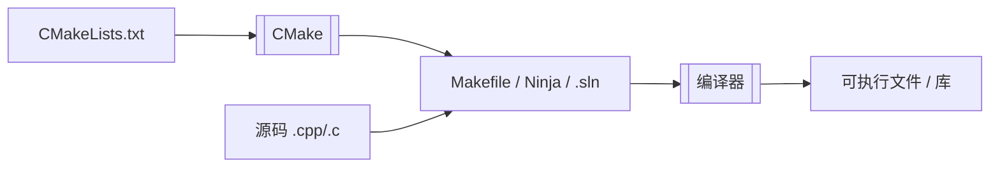

CMake 极速教程
=============

## CMake 是什么

CMake **不是编译器**，也不是直接帮你调用 `gcc` / `cl.exe` 干活。

它更像一个**施工图纸绘制员**：

- 你写 `CMakeLists.txt`，告诉它项目有哪些源文件、要链接哪些库。
- 它在不同的平台上生成真正给编译器用的工程文件：Makefile、Ninja、Visual Studio 解决方案等。
- 然后你再调用 `cmake --build` 去编译。



所以 CMake 学的是**怎么描述项目**，不是学怎么写具体的代码。
## 先提醒一下：CMake 版本差异真的很大

网上搜到的 CMake 教程，很可能和你电脑上的 CMake **不是同一套语法**。

CMake 从 2.x 一路演进到 4.x，写法变了好几轮。老教程里常见的这些：

```cmake
include_directories(./include)
link_directories(./lib)
set(CMAKE_CXX_FLAGS "${CMAKE_CXX_FLAGS} -Wall")
```

在旧项目里还能见到，但**不是现在推荐的做法**。

**本文讲的是现代 CMake（3.15 及以上，建议 3.20+）。** 如果你用的是很老的 CMake，或者照着十年前的博客抄，出现“教程能跑、我这边报错”，大概率是版本和写法对不上。

先确认版本：

```bash
cmake --version
```

看到 `3.15` 以下，建议升级后再跟本文。CMake 不像 Git 那样“老命令永远能用”，它真的会删旧接口、改推荐写法。

几个常见“代沟”：

| 老写法（2.x / 早期 3.x） | 新写法（现代 CMake） |
|---|---|
| `include_directories(...)` | `target_include_directories(目标 PRIVATE ...)` |
| `link_directories(...)` | `target_link_libraries(目标 PRIVATE 库名)` |
| 全局改 `CMAKE_CXX_FLAGS` | `target_compile_options(目标 PRIVATE ...)` |
| `cmake .` 在项目根目录直接构建 | `cmake -S . -B build` 源码与构建分离 |
| `add_definitions(-DDEBUG)` | `target_compile_definitions(目标 PRIVATE DEBUG=1)` |

记住一句话：**现代 CMake 的一切尽量挂在“目标”上，而不是全局乱改。**


## 最小可运行示例

一个最简单的 C++ 项目：

```
myapp/
├── CMakeLists.txt
└── main.cpp
```

`main.cpp`：

```cpp
#include <iostream>
int main() {
    std::cout << "Hello CMake\n";
    return 0;
}
```

`CMakeLists.txt`：

```cmake
cmake_minimum_required(VERSION 3.20)

project(MyApp LANGUAGES CXX)

add_executable(myapp main.cpp)

target_compile_features(myapp PRIVATE cxx_std_17)
```

三行核心逻辑：

1. `cmake_minimum_required`：声明最低 CMake 版本，低于此版本直接拒绝配置。
2. `project`：定义项目名和语言。
3. `add_executable`：声明一个可执行文件目标，由哪些源文件组成。

## 日常构建流程（新版推荐）

**不要在源码目录里直接 `cmake .` 乱建文件。** 用 out-of-source build：

```bash
cmake -S . -B build
cmake --build build
```

Windows 下如果生成了 `.exe`：

```bash
./build/myapp        # Linux / macOS
./build/Debug/myapp  # 某些生成器会多一层 Debug 目录
build\Debug\myapp.exe  # MSVC 常见路径
```

`-S` 是源码目录，`-B` 是构建目录。CMake 3.15 起这样写是官方推荐的一行式用法；老教程让你 `mkdir build && cd build && cmake ..`，本质一样，只是新写法更省事。

改完 `CMakeLists.txt` 后，一般重新跑一遍 `cmake -S . -B build` 再 `cmake --build build`。

## 现代 CMake 的核心：target

老 CMake 喜欢改全局变量，像在整个工地广播：“所有人不许吸烟！”

现代 CMake 改成对具体目标下指令：“**这个工位**不许吸烟。”

```cmake
add_executable(myapp main.cpp utils.cpp)

target_include_directories(myapp PRIVATE include)
target_compile_definitions(myapp PRIVATE MY_DEBUG=1)
target_compile_options(myapp PRIVATE -Wall -Wextra)
target_link_libraries(myapp PRIVATE some_lib)
```

`PRIVATE` 的意思是：这些设置**只给 myapp 自己用**，不传递给依赖它的别的目标。还有 `PUBLIC`（自己也用，用我的人也要继承）和 `INTERFACE`（自己不用，用我的人要继承），初学先记 `PRIVATE` 就够。

## 添加库：静态库 / 动态库

### 自己项目里的库

```cmake
add_library(mylib STATIC lib.cpp)
# 或 add_library(mylib SHARED lib.cpp)

add_executable(myapp main.cpp)
target_link_libraries(myapp PRIVATE mylib)
```

`target_link_libraries` 会自动处理头文件路径和链接顺序（如果库也正确设置了 `target_include_directories`）。

### 使用系统或第三方库

```cmake
find_package(Threads REQUIRED)

add_executable(myapp main.cpp)
target_link_libraries(myapp PRIVATE Threads::Threads)
```

注意 `Threads::Threads` 这种带命名空间的写法——这是 **Imported Target**，CMake 3.x 的标配。老教程可能还在写 `-lpthread`，能跑，但不够现代、也不够跨平台。

## 常用命令速查

### 配置项目

```bash
cmake -S . -B build
cmake -S . -B build -DCMAKE_BUILD_TYPE=Release   # 单配置生成器（Make/Ninja）
cmake -S . -B build -G Ninja                     # 指定 Ninja
```

### 编译

```bash
cmake --build build
cmake --build build --config Release   # 多配置生成器（Visual Studio）
cmake --build build -j 8               # 并行编译
```

### 清理 / 重新配置

```bash
cmake --build build --target clean
rm -rf build   # 或者直接删 build 目录重来，简单粗暴但有效
```

## 一份稍微像真项目的 CMakeLists.txt

```cmake
cmake_minimum_required(VERSION 3.20)
project(Demo LANGUAGES CXX)

add_library(demo_lib src/utils.cpp)
target_include_directories(demo_lib PUBLIC include)
target_compile_features(demo_lib PUBLIC cxx_std_17)

add_executable(demo_app src/main.cpp)
target_link_libraries(demo_app PRIVATE demo_lib)
```

目录结构：

```
Demo/
├── CMakeLists.txt
├── include/
│   └── utils.h
└── src/
    ├── main.cpp
    └── utils.cpp
```

这里 `demo_lib` 用 `PUBLIC include`，是因为头文件要暴露给链接它的 `demo_app`。这就是 modern CMake 里“把依赖关系说清楚”的典型写法。

## 版本相关：再强调一次

下面这些功能，**老 CMake 要么没有，要么用法不同**：

- **`cmake -S / -B`**：CMake 3.13 实验性支持，3.15 起推荐日常使用。
- **`target_*` 系列命令**：CMake 3.x 主流写法，2.x 时代几乎没有。
- **`FetchContent`**：CMake 3.14+，在配置阶段直接从 Git 拉依赖。
- **`cmake --preset`**：CMake 3.19+ 配合 `CMakePresets.json`，团队统一构建配置。
- **C++ 标准**：推荐 `target_compile_features(... cxx_std_17)`，而不是只写 `set(CMAKE_CXX_STANDARD 17)`——后者是全局设置，能用，但不如挂到 target 上精确。

如果你打开一个开源项目，看到 `cmake_minimum_required(VERSION 2.8)`，别慌，它能跑；但如果你在新项目里还写 2.8，CMake 4.x 可能已经不想理你了。

**新项目建议：**

```cmake
cmake_minimum_required(VERSION 3.20)
```

## 新手推荐工作流

```bash
# 1. 写 CMakeLists.txt
# 2. 配置
cmake -S . -B build

# 3. 编译
cmake --build build

# 4. 运行
./build/demo_app    # 路径按实际生成器调整
```

改源文件：直接 `cmake --build build`。

改 `CMakeLists.txt`：重新 `cmake -S . -B build`，再 build。

报错先看 `cmake --version`，再对照本文是不是用了需要更高版本的功能。

## 最后总结

CMake 本质上就干三件事：

1. **描述项目**：有哪些目标（可执行文件、库）、源文件是什么。
2. **描述依赖**：头文件路径、链接哪些库、编译选项是什么。
3. **生成构建系统**：让 Make / Ninja / MSVC 去真正编译。

初学只记这些就够了：

```cmake
cmake_minimum_required(VERSION 3.20)
project(项目名 LANGUAGES CXX)
add_executable(或 add_library)
target_link_libraries / target_include_directories
```

构建只需要这两条命令：

```bash
cmake -S . -B build
cmake --build build
```

