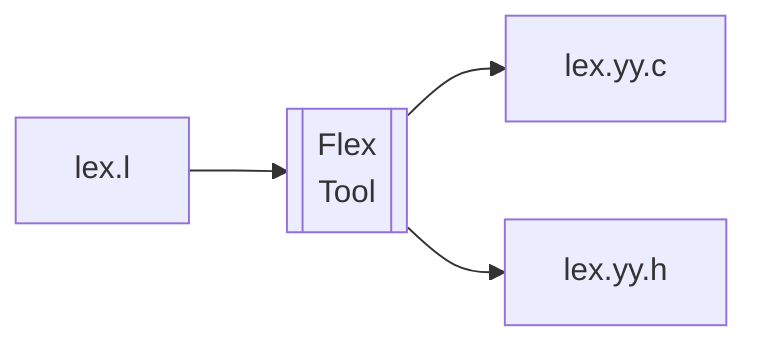

Flex 极速教程
=============

Flex是一个流行的词法分析器的生成器工具，你可以快速的通过编写DSL，来生成一个词法分析器。




Flex的文件分为三个部分，开头的定义，中间的规则，和结尾的用户自定义函数：

```flex
   // 这里可以放规则定义

[0-9] NUM

%%
    // 这里更加定义的先后，设置一系列要匹配的词法规则
{NUM}+  

%%
    // 这里是用户自定义函数

```


## Flex的安装

在Ubuntu上，你可以通过apt-get来安装Flex：

```bash
sudo apt-get install flex
```

## 一个简单的例子

比如我们来尝试匹配一个简单的表达式计算的词法：

```flex

[0-9]+ NUM

%%

{NUM}  printf("%d\n", atoi(yytext));
[ \t]  /* skip whitespace */
\n     printf("NEWLINE\n");

%%

int main() {
    yylex();
    return 0;
}
```


