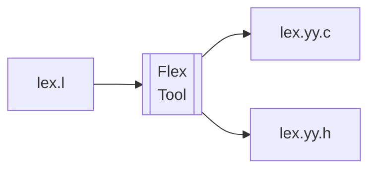

Flex 极速教程
=============

Flex是一个流行的词法分析器的生成器工具，你可以快速的通过编写DSL，来生成一个词法分析器。


```mermaid
flowchart LR
    lex.l --> flex[[Flex<br>Tool]] --> lex.yy.c
    flex[[Flex<br>Tool]] --> lex.yy.h
```


Flex的文件分为三个部分，开头的定义，中间的规则，和结尾的用户自定义函数：

```flex
   // 这里可以放

[0-9] NUM

%%
{NUM}+  

%%


```
