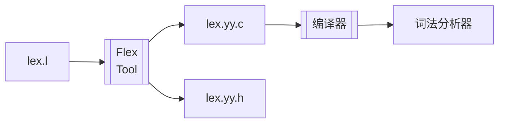
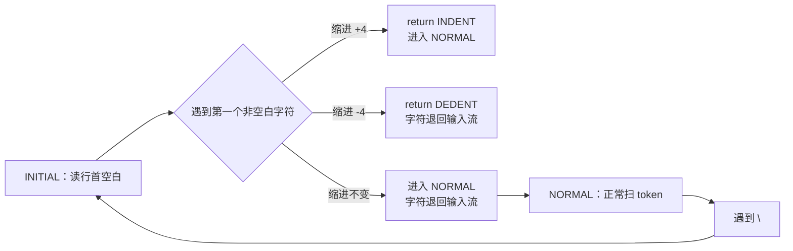

Flex 极速教程
=============

Flex 是一个流行的**词法分析器生成器**。你不用手写 `switch` 逐字符扫字符串，只要写一份 `.l` 规则文件，Flex 就会帮你生成 `lex.yy.c`——一个能切分 token 的词法分析器。


```mermaid
flowchart LR
    lex.l --> flex[[Flex<br>Tool]] --> lex.yy.c
    flex[[Flex<br>Tool]] --> lex.yy.h
    lex.yy.c --> compiler[[编译器]] --> scanner[词法分析器]
```

一句话：**你写正则 + 动作，Flex 自动生成 C 代码。**

## 先提醒：Flex 也有“代沟”

Flex 源自 Unix 的 Lex，但现在已经不是同一个东西了。常见差异：

| 情况 | 说明 |
|---|---|
| **Lex vs Flex** | Lex 是老古董；现在几乎都用 GNU Flex。语法大体兼容，但选项和行为细节不同。 |
| **Flex 2.5 vs 2.6** | 2.6 起完善了与 Bison 3 的 `%option bison-bridge` 等桥接选项。 |
| **Windows 上的 flex** | 可能是 `win_flex`，行为和 Linux 上的 GNU flex 略有差别，报错信息也可能不一样。 |

**本文按 GNU Flex 2.6+ 的现代用法来写。** 老教程里手动写 `yywrap()`、全局 `yyin`/`yyout` 的写法仍然常见，但新项目更推荐 `%option noyywrap` 等显式选项。

先确认版本：

```bash
flex --version
```

## `.l` 文件的三段式结构

Flex 文件固定分成三块，用 `%%` 隔开：

```flex
/* 第一段：定义区（选项、头文件、正则别名） */

%option noyywrap
%option nounput
%option noinput

%{
#include <stdio.h>
#include "parser.tab.h"   /* 如果和 Bison 联用，token 枚举在这里 */
%}

DIGIT   [0-9]
LETTER  [A-Za-z_]

/* 第二段：规则区（正则 + 匹配后动作） */
%%
{DIGIT}+        { return NUMBER; }
{LETTER}({LETTER}|{DIGIT})*  { return IDENT; }
[ \t\r\n]+      { /* 忽略空白 */ }
.               { return yytext[0]; }   /* 未知字符，原样返回 */
%%

/* 第三段：用户代码区（辅助函数，可选） */
```

对应关系：

1. **定义区**：放 `%option`、C 代码块、正则别名（如 `DIGIT [0-9]`）。
2. **规则区**：核心。每行是 `模式 { 动作 }`，匹配到了就执行动作。
3. **用户代码区**：放你自己写的 C 函数，比如 `main` 测试入口。

## 最小可运行示例

`calc.l`——只识别整数和 `+ - * / ( )`：

```flex
%option noyywrap nounput noinput

%{
#include <stdio.h>
enum { NUM = 256, ADD, SUB, MUL, DIV };
%}

%%
[0-9]+          { printf("NUM %s\n", yytext); return NUM; }
"+"             { return ADD; }
"-"             { return SUB; }
"*"             { return MUL; }
"/"             { return DIV; }
[ \t\n]+        { /* skip */ }
.               { printf("未知字符: %s\n", yytext); }
%%

int main(void) {
    while (yylex() != 0) { /* 一直扫到 EOF */ }
    return 0;
}
```

生成并编译：

```bash
flex calc.l          # 生成 lex.yy.c
cc -o calc lex.yy.c -lfl   # Linux: -lfl；macOS 可能是 -ll
./calc
# 然后输入: 1+2*3 回车，Ctrl+D 结束（Windows 可能是 Ctrl+Z）
```

Windows 上如果没有 `-lfl`，有时需要手动链接或改用 CMake 管理（见后文）。

## 匹配规则：最长优先，一样长则靠前

Flex 不是“谁先写正则谁就赢”，规则是：

1. **最长匹配优先**（longest match）
2. 长度相同时，**文件里更靠前的规则优先**

例子：

```flex
%%
"if"            { return IF; }
[a-z]+          { return IDENT; }
```

输入 `if` 会匹配关键字 `if`，不会变成 IDENT。  
输入 `iffy` 会整体匹配 IDENT（更长）。

这和编译原理里说的“正则列表 + 优先级”是一回事，只是 Flex 把优先级默认绑定成了**规则书写顺序**。

## 常用 `%option`

```flex
%option noyywrap      /* 不提供 yywrap，EOF 时直接结束 */
%option nounput noinput  /* 抑制编译器警告 */
%option yylineno      /* 维护 yylineno，报错时可显示行号 */
%option case-insensitive  /* 规则大小写不敏感 */
%option bison-bridge  /* 与 Bison 3 联用时推荐 */
```

### 关于 `yywrap`

老教程会让你写：

```c
int yywrap(void) { return 1; }
```

意思是“没有下一个输入文件了”。  
现代写法直接 `%option noyywrap`，省得每个项目都复制粘贴这个函数。

## 动作里常用的内置变量/函数

| 名字 | 含义 |
|---|---|
| `yytext` | 当前匹配到的字符串（`char *`） |
| `yyleng` | 匹配长度 |
| `yylineno` | 当前行号（需 `%option yylineno`） |
| `yylex()` | 执行一次扫描，返回 token |
| `yyin` / `yyout` | 输入/输出文件指针，默认 stdin/stdout |
| `unput(c)` | 把字符退回输入流（少用，但调试 handy） |

典型动作：

```flex
{DIGIT}+   { yylval = atoi(yytext); return NUMBER; }
"//".*     { /* 单行注释，吞掉 */ }
```

## 开始条件（Start Conditions）

有时词法规则和上下文有关，比如 `"` 进字符串模式，`/*` 进注释模式：

```flex
%x STR

%%
\"          { BEGIN(STR); }
<STR>[^\"\\]+  { /* 字符串内容 */ }
<STR>\\\"   { /* 转义引号 */ }
<STR>\"     { BEGIN(INITIAL); return STRING; }
```

`INITIAL` 是默认状态。`%x STR` 定义独占状态；还有 `%s`  inclusive 状态，初学知道 `%x` 够用。

## 和 Bison 联用

做编译器时，Flex 通常不负责 `main`，只提供 `yylex()`；Bison 的 `yyparse()` 会反复调用它。

典型分工：

- **Flex**：识别 token，必要时设置 `yylval`
- **Bison**：根据 token 流做语法分析

`.l` 文件里常见：

```flex
%option bison-bridge
%{
#include "parser.tab.h"
#define YY_DECL int yylex(YYSTYPE *yylval_param, yyscan_t yyscanner)
%}
```

Bison 的细节放在 [bison.md](bison.md)，这里只要知道：**Flex 管“切词”，Bison 管“造句”。**

## 用 CMake 集成 Flex

配合 [cmake.md](cmake.md) 的现代写法，可以用 `FindFlex`：

```cmake
cmake_minimum_required(VERSION 3.20)
project(LexDemo LANGUAGES C)

find_package(FLEX REQUIRED)

flex_target(Scanner calc.l ${CMAKE_CURRENT_BINARY_DIR}/lex.yy.c)

add_executable(calc ${FLEX_Scanner_OUTPUTS})
target_include_directories(calc PRIVATE ${CMAKE_CURRENT_BINARY_DIR})
target_link_libraries(calc PRIVATE ${FLEX_LIBRARIES})
```

这样不用手敲 `flex calc.l`，改 `.l` 文件会自动重新生成。

## 新手常踩的坑

1. **忘记 `%option noyywrap`**：链接时报 `undefined reference to yywrap`。
2. **规则区没写动作**：空动作 `{}` 合法，表示“匹配但什么都不做”——注释、空白常这么写。
3. **`.` 规则放太靠前**：`.` 能匹配任意单字符，通常会吃光所有“兜底”输入，一般放最后。
4. **把 C 代码写进规则区但没包 `{}`**：Flex 会把你的 C 语句当正则解析，报错非常抽象——看到 bizarre 报错先检查 `{}`。
5. **复制 Linux 教程在 Windows 编译**：`-lfl`、路径、换行符都可能不一样，先 `flex --version` 确认环境。

## 日常流程

```bash
# 1. 写 xxx.l
# 2. 生成 C 文件
flex xxx.l

# 3. 编译 lex.yy.c（和你的 parser、main 一起）
cc -o mylexer lex.yy.c main.c -lfl

# 4. 运行
./mylexer < input.txt
```

改规则后重新 `flex xxx.l` 再编译。用 CMake 的话，`cmake --build` 会自动帮你做这一步。

## 最后总结

Flex 就干三件事：

1. **定义 token 长什么样**（正则 / 别名）
2. **定义匹配后干什么**（`return TOKEN`、`yylval = ...`、忽略）
3. **生成 `yylex()`** 供主程序或 Bison 调用

初学只记这个骨架：

```flex
%option noyywrap nounput noinput
%{ /* 头文件 */ %}
别名定义
%%
规则 { 动作 }
%%
/* 可选辅助代码 */
```

构建只记：

```bash
flex xxx.l
```

词法分析的本质没变：**按优先级和最长匹配切 token**。Flex 只是把这个过程自动化了，让你专注写规则，而不是手写状态机 switch。

如果你已经会正则表达式，Flex 的上手成本很低——本质上就是“**带动作的、有优先级的正则列表**”。剩下的坑，多半出在版本差异和与 Bison 的接口上，而不是 Flex 本身有多玄学。


## 扩展延伸

对于Flex来说，有很多不同的实现风格，如 C、C++ 等，还会涉及一些高级用法，这里简要列出了一些常见的问题。这里的代码均可以在仓库 [flex-bison-examples](https://github.com/sunxfancy/flex-bison-examples) 中找到。

### 中文等 Utf-8 支持

Flex 默认按**字节**扫描，不是按 Unicode 码点。好消息是：如果你的源文件是 UTF-8，**ASCII 范围内的 token**（关键字、运算符、数字）照样正常工作；中文通常出现在**字符串字面量**或**注释**里，不必强行让 Flex “认识中文关键字”。

Utf-8 是一种变长编码，每个字符 1～4 字节。ASCII 字符仍是单字节，且与 UTF-8 兼容。常见中文在 UTF-8 里一般是 3 字节，例如 `中` 的编码为 `E4 B8 AD`。那么它是如何控制编码长度的呢？

1. 如果第一个字节以 0 开头，那么这个字符就是单字节，如 `A` 的编码为 `0x41` 即 `01000001`。
2. 第一个字节的前 n 位为 1，紧接着的第 n + 1 位为 0，表示该字符占用 n 个字节；后续字节的前两位固定为 10，后面的位用于表示字符的 Unicode 码。如 `中` 的编码为 `E4 B8 AD`，即 `11100100 10111000 10101101`，那么它占用 3 个字节。

也就是说，`中` 的 UTF-8 编码可以这样拆：

```text
E4        B8        AD
11100100  10111000  10101101
^^^^      ^^        ^^
1110      10        10
3字节开头  后续字节  后续字节
```

所以 Flex 如果用 `.` 去扫中文，它不是一次吃掉整个 `中`，而是先吃 `E4`，再吃 `B8`，最后吃 `AD`。这就是为什么前面强调：Flex 默认看见的是**字节流**，不是“一个个汉字”。

于是，一个可以匹配 UTF-8 多字节字符的正则可以这样写。完整示例见仓库：[utf8/lexer.l](https://github.com/sunxfancy/flex-bison-examples/blob/master/utf8/lexer.l)（思路来自 [Stack Overflow 讨论](https://stackoverflow.com/questions/9611682/flexlexer-support-for-unicode/9617585)）：

```flex
/* 后续字节：10xxxxxx */
U       [\x80-\xbf]

/* 首字节：110xxxxx / 1110xxxx / 11110xxx */
U2      [\xc2-\xdf]    /* 2 字节字符 */
U3      [\xe0-\xef]    /* 3 字节字符，如 中 的首字节 E4 */
U4      [\xf0-\xf4]    /* 4 字节字符 */

/* 只匹配非 ASCII 的 UTF-8 字符 */
UONLY   {U2}{U}|{U3}{U}{U}|{U4}{U}{U}{U}

/* 匹配任意字符（ASCII 或 UTF-8） */
UANY    [\x00-\x7f]|{U2}{U}|{U3}{U}{U}|{U4}{U}{U}{U}

%%

"类型"           { return TYPE; }              /* 中文关键字 */
{UONLY}+         { SAVE_TOKEN; return ID; }   /* 中文标识符 */
\"({UANY}|\\.)*\" { SAVE_STRING; return STRING; }
```

对照前面的 `中 = E4 B8 AD`：

- `U3` 匹配首字节 `E4`（落在 `\xe0-\xef`）
- 后面两个 `U` 分别匹配 `B8`、`AD`（落在 `\x80-\xbf`）
- 三个字节拼起来，Flex 才认为匹配到了**一个** `{UONLY}` token

所以 `{UONLY}+` 可以识别 `变量名` 这种中文标识符；而 `\"...\"` 里用 `UANY` 则允许 ASCII 和中文混写字符串。

### 可重入性

默认 Flex 生成的 `yylex()` 大量使用**全局变量**：`yytext`、`yylineno`、`yyin`……  
单线程、单文件扫描时没问题；一旦你想：

- 同时扫两个输入流；
- 在多线程里各跑一个词法器；
- 递归/嵌套 include 时再开一层扫描；

全局状态就会互相踩踏。Flex 2.6 的解法是 **可重入（reentrant）** 扫描器：所有状态塞进 `yyscan_t`，每个实例各用各的。

开启方式：

```flex
%option reentrant bison-bridge
%option noyywrap nounput noinput
%option extra-type="struct LexExtra*"

%{
#include "parser.tab.h"

struct LexExtra {
    int error_count;
    const char *filename;
};

#define YY_DECL int yylex(YYSTYPE *yylval, yyscan_t yyscanner)
%}

%%
[0-9]+   { return NUMBER; }
[a-z]+   { return IDENT; }
.        { return yytext[0]; }
%%
```

使用侧（注意生命周期）：

```c
yyscan_t scanner;
struct LexExtra extra = { .error_count = 0, .filename = "input.txt" };

if (yylex_init_extra(&extra, &scanner) != 0) { /* 出错 */ }

FILE *f = fopen("input.txt", "r");
yyset_in(f, scanner);

YYSTYPE yylval;
while (yylex(&yylval, scanner) != 0) { /* 扫 token */ }

fclose(f);
yylex_destroy(scanner);
```

几个要点：

| 默认写法 | 可重入写法 |
|---|---|
| `yylex()` | `yylex(&yylval, scanner)` |
| `yyin = f` | `yyset_in(f, scanner)` |
| 全局 `yyextra` | `yylex_init_extra(&extra, &scanner)` |
| 单实例 | 多个 `yyscan_t` 互不干扰 |

与 Bison 联用时，`%option reentrant bison-bridge` 常成对出现；Bison 侧也要 `%define api.pure full` 等配置（详见 [bison.md](bison.md)）。

**什么时候需要？** 写编译器 demo 不必强行上；写 IDE 插件、多文件并行预处理、嵌入式脚本多次 `eval` 时，可重入能省很多“怎么 reset 全局状态”的玄学 bug。

### Python 风格的缩进该如何处理

Python 的缩进**不是**源文件里的字面 token。你看不见一个叫 `INDENT` 的字符——它是词法器根据**行首空白列数**算出来的。  
所以 Flex 不能只靠 `{空格}+` 一条正则搞定，得用**状态机**在行首专门统计缩进。

完整可运行示例见仓库：[python-like-indentation/lexer.l](https://github.com/sunxfancy/flex-bison-examples/blob/master/python-like-indentation/lexer.l)（思路来自 [Stack Overflow 讨论](https://stackoverflow.com/questions/1413204/how-to-use-indentation-as-block-delimiters-with-bison-and-flex)）。

#### 核心思路：两个状态

参考实现用了两个 start condition：

| 状态 | 干什么 |
|---|---|
| `INITIAL`（默认） | 行首阶段：逐个读空格/Tab，累计 `current_line_indent` |
| `NORMAL` | 正常阶段：识别关键字、标识符、运算符等 token |

外加两个全局变量：

- `current_line_indent`：当前物理行已经读到的缩进列数
- `indent_level`：已经交给语法分析器的逻辑缩进层级

流程可以概括成：


```mermaid
flowchart LR
    A["INITIAL：读行首空白"] --> B{"遇到第一个非空白字符"}
    B -->|"缩进 +4"| C["return INDENT<br>进入 NORMAL"]
    B -->|"缩进 -4"| D["return DEDENT<br>字符退回输入流"]
    B -->|"缩进不变"| E["进入 NORMAL<br>字符退回输入流"]
    E --> F["NORMAL：正常扫 token"]
    F --> G["遇到 \\n"]
    G --> A
```

#### 参考实现的关键代码

`INITIAL` 阶段：只关心空白；遇到第一个“真正的 token 字符”时，用 `unput()` 把它塞回输入流，再决定发 `INDENT` / `DEDENT` 还是进入 `NORMAL`：

```flex
%option yylineno
%option noyywrap

%{
#include "parser.h"
int current_line_indent = 0;   /* 当前行的缩进列数 */
int indent_level = 0;            /* 已确认的逻辑缩进层级 */
%}

%x NORMAL

%%
" "     { current_line_indent++; }
"\t"    { current_line_indent = (current_line_indent + 4) & ~3; }
"\n"    { current_line_indent = 0; }

.       {
          unput(*yytext);   /* 第一个非空白字符先放回去，稍后在 NORMAL 里再读 */

          if (current_line_indent > indent_level) {
              if (current_line_indent == indent_level + 4) {
                  indent_level = current_line_indent;
                  BEGIN(NORMAL);
                  return INDENT;
              } else {
                  /* 缩进不是严格 +4，报错 */
              }
          } else if (current_line_indent < indent_level) {
              if (indent_level - current_line_indent < 4) {
                  /* 缩进对不齐，报错 */
              }
              indent_level -= 4;
              return DEDENT;   /* 一次只退一层，多层要多次调用 yylex */
          } else {
              BEGIN(NORMAL);
          }
        }

<<EOF>> {
          if (current_line_indent < indent_level) {
              indent_level -= 4;
              return DEDENT;   /* 文件结束前把栈弹干净 */
          } else {
              return YYEOF;
          }
        }

<NORMAL>{
    "\n"                    { current_line_indent = 0; return '\n'; }
    [ \t]                   { /* 行内空白忽略 */ }
    [a-zA-Z_][a-zA-Z0-9_]*  { return TID; }
    /* ... 其他 token 规则 ... */
}
%%
```

和之前“先算列号、再调 `handle_indent()`”的写法相比，这个例子的特点是：

1. **不用单独的 `AFTER_NEWLINE` 状态**，而是默认 `INITIAL` 专门吃行首空白。
2. **用 `unput()` 退回字符**，避免把“判断缩进的触发点”和“读 token”绑死在同一规则里。
3. **缩进步长固定为 4**（空格 +1，Tab 按 4 列对齐），是教学 demo，不是完整 CPython 实现。

#### 为什么要 `unput()`？

当 Flex 在 `INITIAL` 里读到 `if` 的 `i` 时，这个字符既是“缩进结束信号”，本身又应该是 `IF` token 的一部分。

如果不在动作里 `unput(*yytext)`，就会出现：

- 要么 `i` 被缩进逻辑吃掉，后面的 token 规则读不到完整单词；
- 要么你得在缩进逻辑里手动拼 token，Flex 规则迅速膨胀成灾难。

`unput()` 的意思就是：**“我知道了，这里缩进算完了；刚才那个字符不算缩进，放回去，NORMAL 状态重新读。”**

#### 两个实现上的坑

1. **一次只吐一个 DEDENT**：参考实现里 `indent_level -= 4` 后 `return DEDENT`，如果要从 12 空格退回 0，需要 parser 多次调用 `yylex()`，或在 `<<EOF>>` 里循环退栈。这也是 Bison 里 `%destructor` / 空规则配合的常见写法。
2. **这是简化版，不是完整 Python**：示例固定 4 空格一级，没有处理括号续行（implicit line joining）、也没有混用 Tab/空格 的完整报错逻辑。工业级 CPython 前端还要维护 pending token 队列和括号深度——Flex 仍然负责字符级扫描，但缩进算法会比这个 demo 长得多。

**一句话总结**：Python 缩进是**上下文相关**的。参考实现的做法是——**INITIAL 统计行首空白，首个非空白字符触发 INDENT/DEDENT，NORMAL 负责正常 token**；比堆抽象 helper 函数更贴近真实 Flex 项目。

更多可运行示例见仓库 [flex-bison-examples](https://github.com/sunxfancy/flex-bison-examples)。
