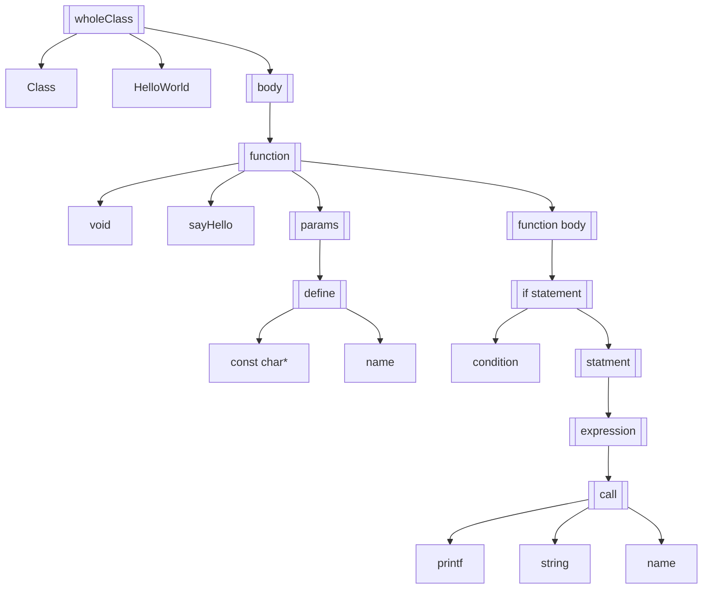

语法分析（Parsing）
===================

语法分析是编译器前端分析的核心，它的任务是根据词法分析得到的词法单元序列，构造语法分析树或语法分析树的翻译，同时进行语法错误检查。一个编程语言，语法规则的识别就是在这个模块中完成的。

## 语法树

我们在写编程语言时，会发现很多代码都是嵌套结构的，比如类下面有函数，函数下面有语句，语句里面套表达式，表达式里面有函数调用，函数调用下面有参数，等等。

```cpp
class HelloWorld {
public:
    void sayHello(const char* name) {
        if (name) {
            printf("Hello World, %s!", name);
        }
    }
};
```

语法树就是用多叉树结构将语法按层次表示出来，比如上面的代码，我们可以表示为：




我们在进行语法分析的时候，就在构造这样的语法树。

## 语法规则的描述

首先遇到的问题是，我们应该如何描述一个编程语义的语法？经典的方式是使用BNF（巴科斯范式）或者EBNF（扩展巴科斯范式）来描述。比如我们可以用下面的EBNF来描述一个简单的四则运算的语法：

```
<expression> ::= <term> { <addop> <term> }
<addop>      ::= + | -
<term>       ::= <factor> { <mulop> <factor> }
<mulop>      ::= * | /
<factor>     ::= ( <expression> ) | Number
```

这边，我们一般把BNF中的符号划分为两种：**终结符** 与 **非终结符**


`<ClientOnly><ParseTree /></ClientOnly>`


## 什么是语法分析

语法分析方法，根据分析的顺序，大多数都可以划分为两大类方法：

1. 自顶向下分析 - 从语法树的根节点开始，逐步向下伸展叶子节点，并完成整个语法树的分析
2. 自底向上分析 - 从语法树的叶子节点开始，合并规约形成子树，逐渐合并成整颗语法树

## 自顶向下分析法（LL）

自顶向下分析很多时候也叫做预测分析，因为它的分析过程是根据当前的输入符号，预测下一个可能的语法单元，然后根据这个预测的语法单元，继续向下分析，直到分析完成。

## 自底向上分析法（LR）

自顶向上分析法，也叫做移进归约分析法，它的分析过程是从输入符号串的左端开始，逐步向右扫描，将符号串中的一段符号归约为一个非终结符号，直到整个符号串归约为文法的开始符号。

## 语法分析的实现

### 手工实现递归下降分析器

手工实现一个递归下降分析器，其实就是手工实现预测分析的过程，我们首先写出LL(1)文法，然后根据预测结果，递归调用每个文法的分析函数。


### 使用工具生成语法分析器

手工实现语法分析器，虽然可以让我们更好的理解语法分析的过程，但是对于复杂的语法，手工实现的过程也是非常繁琐的。所以我们一般会使用工具来生成语法分析器。LR(1) 文法采用规约的方式，由不同状态进行匹配，在可以规约的时候则规约成为新的语法树，这非常适合工具自动生成。

