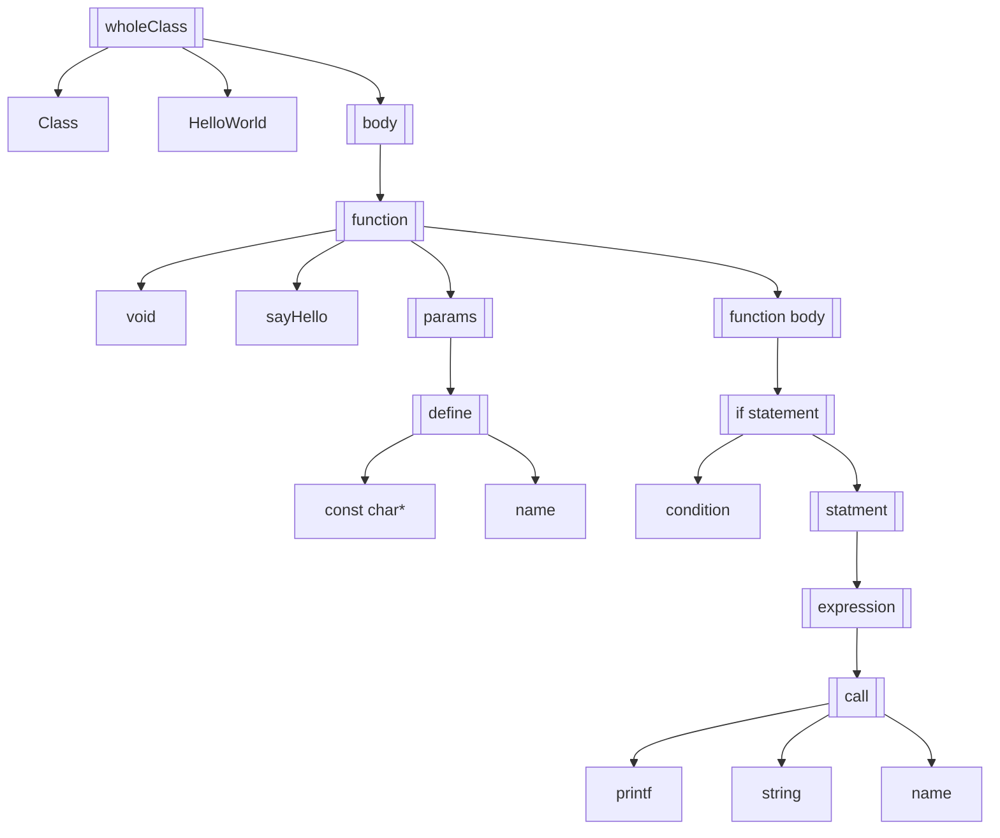

语法分析（Parsing）
===================

语法分析是编译器前端分析的核心，它的任务是根据词法分析得到的词法单元序列，构造语法分析树或语法分析树的翻译，同时进行语法错误检查。一个编程语言，语法规则的识别就是在这个模块中完成的。

## 语法树

我们在写编程语言时，会发现很多代码都是嵌套结构的，比如类下面有函数，函数下面有语句，语句里面套表达式，表达式里面有函数调用，函数调用下面有参数，等等。

```cpp
class HelloWorld {
public:
    void sayHello(const char* name) {
        if (name) {
            printf("Hello World, %s!", name);
        }
    }
};
```

语法树就是用多叉树结构将语法按层次表示出来，比如上面的代码，我们可以表示为：



```mermaid
graph TD;
    wc[[wholeClass]] --> Class
    wc --> HelloWorld
    wc --> body[[body]]
    body --> func[[function]]
    func --> void
    func --> sayHello
    func --> params[[params]]
    func --> funcbody[[function body]]
    params --> def[[define]]
    def --> type[const char*]
    def --> name
    funcbody --> ifs[[if statement]]
    ifs --> condition
    ifs --> stat[[statment]]
    stat --> expr[[expression]]
    expr --> c[[call]]
    c --> printf
    c --> string
    c --> n[name]
```

我们在进行语法分析的时候，就在构造这样的语法树。

## 语法规则的描述

首先遇到的问题是，我们应该如何描述一个编程语义的语法？经典的方式是使用BNF（巴科斯范式）或者EBNF（扩展巴科斯范式）来描述。比如我们可以用下面的EBNF来描述一个简单的四则运算的语法：

```
<expression> ::= <term> { <addop> <term> }
<addop>      ::= + | -
<term>       ::= <factor> { <mulop> <factor> }
<mulop>      ::= * | /
<factor>     ::= ( <expression> ) | Number
```

这边，我们一般把BNF中的符号划分为两种：**终结符** 与 **非终结符**


<ClientOnly><ParseTree /></ClientOnly>


## 什么是语法分析

语法分析方法，根据分析的顺序，大多数都可以划分为两大类方法：

1. 自顶向下分析 - 从语法树的根节点开始，逐步向下伸展叶子节点，并完成整个语法树的分析
2. 自底向上分析 - 从语法树的叶子节点开始，合并规约形成子树，逐渐合并成整颗语法树

## 自顶向下分析法（LL）

自顶向下分析很多时候也叫做预测分析，因为它的分析过程是根据当前的输入符号，预测下一个可能的语法单元，然后根据这个预测的语法单元，继续向下分析，直到分析完成。
简要来说，如果有一个文法，解析后的语法树为T, 那么自顶向下分析的过程就是，从T的根节点开始，逐步向下伸展叶子节点，并完成整个语法树的分析。

<ClientOnly><ParseTree topdown='true' /></ClientOnly>


## 自底向上分析法（LR）

自顶向上分析法，也叫做移进归约分析法，它的分析过程是从输入符号串的左端开始，逐步向右扫描，将符号串中的一段符号归约为一个非终结符号，直到整个符号串归约为文法的开始符号。


<ClientOnly><ParseTree bottomup='true' /></ClientOnly>
## 语法分析的实现

### 手工实现递归下降分析器

手工实现一个递归下降分析器，其实就是手工实现预测分析的过程，我们首先写出LL(1)文法，然后根据预测结果，递归调用每个文法的分析函数。下面以本章前面的四则运算文法为例，走一遍完整过程。

#### 1. 确认文法适合 LL(1)

递归下降要求用**当前一个 Token**就能决定走哪条产生式。检查本文法：

- 无左递归（乘除在 `term` 层，加减在 `expression` 层，优先级由层次决定）
- `factor` 的两条规则以 `(` 和 `Number` 区分，无公共前缀歧义

因此可以直接实现，无需消左递归。

#### 2. 将 EBNF 映射为代码结构

| EBNF 写法 | 代码写法 |
|-----------|----------|
| `A B C` 串联 | 顺序调用 |
| `A \| B` 选择 | `if / else if`（依据 lookahead） |
| `{ X }` 零次或多次 | `while` 循环 |

对应关系：

```
parseExpression()  →  parseTerm(); while (+ 或 -) { parseAddOp(); parseTerm(); }
parseTerm()        →  parseFactor(); while (* 或 /) { parseMulOp(); parseFactor(); }
parseFactor()      →  if ('(') { 吃 '('; parseExpression(); 吃 ')'; }
                     else if (Number) { 吃 Number; }
```

#### 3. 准备 Token 与 Parser 骨架

语法分析器只消费 Token，不关心字符细节。Parser 需要两个基本操作：

- `peek()`：查看当前 Token（向前看，不消费）
- `eat()` / `expect()`：匹配并消费 Token

每个非终结符对应一个 `parse*` 函数，在函数内根据 `peek()` 的 Token 类型做预测。

#### 4. 实现各文法函数

**`parseFactor`** — 最底层，括号分支会递归调用 `parseExpression`：

```cpp
void parseFactor() {
    if (peek() == '(') {
        eat('(');
        parseExpression();
        expect(')');
    } else if (peek() == Number) {
        eat(Number);
    } else {
        error("期望数字或 '('");
    }
}
```

**`parseTerm`** 与 **`parseExpression`** — 分别用 `while` 处理 `{ mulop factor }` 和 `{ addop term }`：

```cpp
void parseTerm() {
    parseFactor();
    while (peek() == '*' || peek() == '/') {
        parseMulOp();
        parseFactor();
    }
}

void parseExpression() {
    parseTerm();
    while (peek() == '+' || peek() == '-') {
        parseAddOp();
        parseTerm();
    }
}
```

#### 5. 手工走一遍 `2*3+4*5`

1. `parseExpression` → 调用 `parseTerm`，处理 `2*3`（`parseFactor` 吃 `2`，`while` 循环吃 `*3`）
2. `while` 看到 `+`，进入加减层：`parseAddOp` 吃 `+`，再 `parseTerm` 处理 `4*5`
3. 输入结束，两个 `while` 均退出，解析成功

乘除先于加减被归约，是因为它们在文法中处于更深层，而非在代码里硬编码优先级。

#### 方法小结

1. 写出 LL(1) 文法，确认无左递归
2. EBNF 的 `{ }` → `while`，` | ` → `if/else`，串联 → 顺序调用
3. 每个非终结符一个函数，用 `peek()` 预测，`eat()` 消费
4. 先实现能正确匹配输入的版本，再扩展为返回 AST 节点

### 使用工具生成语法分析器

手工实现语法分析器，虽然可以让我们更好的理解语法分析的过程，但是对于复杂的语法，手工实现的过程也是非常繁琐的。所以我们一般会使用工具来生成语法分析器。LR(1) 文法采用规约的方式，由不同状态进行匹配，在可以规约的时候则规约成为新的语法树，这非常适合工具自动生成。

下面以 Bison 为例，简单看一下如何写一个自底向上的表达式分析器。Bison 本身负责语法分析，通常还需要配合一个词法分析器（比如 Flex，或者手写 `yylex`）不断返回 Token。

#### 1. 描述终结符

首先声明词法分析阶段会返回哪些 Token。对于前面的四则运算文法，数字可以声明为 `NUMBER`，而 `+ - * / ( )` 这类单字符 Token 可以直接在产生式里使用。

```bison
%token NUMBER
```

#### 2. 处理优先级与结合性

自底向上分析会不断做“移进”或“归约”。表达式文法中，`+`、`*` 等运算符可能产生冲突，因此通常显式声明优先级：

```bison
%left '+' '-'
%left '*' '/'
```

越靠后的声明优先级越高，所以乘除高于加减；`%left` 表示这些运算符是左结合的，例如 `1 - 2 - 3` 会按 `(1 - 2) - 3` 归约。

#### 3. 写出语法规则

Bison 的语法规则由非终结符、产生式和动作组成。一个简化的表达式分析器可以写成：

```bison
%%

input
    : expression
    ;

expression
    : expression '+' expression
    | expression '-' expression
    | expression '*' expression
    | expression '/' expression
    | '(' expression ')'
    | NUMBER
    ;

%%
```

这里看起来出现了左递归，例如 `expression : expression '+' expression`，但这正适合 LR 分析器。递归下降分析器不喜欢左递归，而 Bison 生成的自底向上分析器可以自然处理这类规则。

#### 4. 在产生式中加入语义动作

如果只是判断表达式是否合法，可以不写动作；如果要计算表达式的值，就可以在 `{ ... }` 中写归约时执行的代码：

```bison
expression
    : expression '+' expression { $$ = $1 + $3; }
    | expression '-' expression { $$ = $1 - $3; }
    | expression '*' expression { $$ = $1 * $3; }
    | expression '/' expression { $$ = $1 / $3; }
    | '(' expression ')'        { $$ = $2; }
    | NUMBER                    { $$ = $1; }
    ;
```

其中：

- `$$` 表示当前产生式归约后的值
- `$1`、`$2`、`$3` 表示产生式右侧第 1、2、3 个符号的值

#### 5. 提供词法分析函数

Bison 生成的语法分析器会调用 `yylex()` 获取下一个 Token。`yylex()` 可以由 Flex 生成，也可以手写。它的任务是把输入字符流转换为 Token：

```cpp
int yylex() {
    // 读到数字时返回 NUMBER，并把具体数值放入 yylval
    // 读到 '+', '-', '*', '/', '(', ')' 时直接返回对应字符
    // 输入结束时返回 0
}
```

#### 6. 生成并调用分析器

通常流程如下：

```bash
bison -d parser.y
g++ parser.tab.c lexer.cpp -o parser
```

程序中调用 `yyparse()` 即可启动分析。分析过程中，Bison 会维护一个状态栈和符号栈：能继续读入时就移进，发现栈顶符号能匹配某条产生式右侧时就归约，直到最终归约为开始符号。

#### 7. 和递归下降的区别

递归下降分析器是“从根往叶子推导”，代码结构接近文法函数；Bison 生成的 LR 分析器是“从叶子往根归约”，核心是状态机和栈。前者适合手写和教学，后者更适合复杂文法和自动生成。


