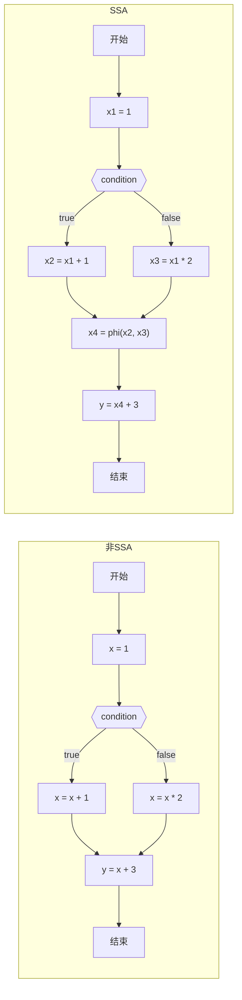

# 静态单赋值（SSA）

静态单赋值（Static Single Assignment，SSA）是一种中间表示形式，其中每个变量只能被赋值一次。这种表示形式在编译器优化中非常有用，因为它简化了数据流分析和转换。在这篇文章中，我们将介绍SSA的基本概念，以及如何将常规的控制流图（Control Flow Graph，CFG）转换为SSA形式。

核心特征：
1. 每个变量只能被赋值一次
2. 使用phi函数来处理不同控制流的赋值

## SSA形式与非SSA形式的对比

为了更好地理解SSA形式，让我们通过一个简单的例子来对比SSA形式和非SSA形式的代码。

### 非SSA形式的代码

考虑以下简单的代码片段：

```c
int x = 1;
if (condition) {
    x = x + 1;
} else {
    x = x * 2;
}
y = x + 3;
```

这段代码中，变量`x`被多次赋值，这就是非SSA形式的特点。我们可以绘制这段代码的控制流图：

### SSA形式的代码

现在，让我们看看等价的SSA形式：

```c
int x1 = 1;
if (condition) {
    int x2 = x1 + 1;
} else {
    int x3 = x1 * 2;
}
int x4 = φ(x2, x3);  // phi函数，根据控制流选择x2或x3
int y = x4 + 3;
```

在SSA形式中，每个变量只被赋值一次，我们使用不同的变量名（x1, x2, x3, x4）来表示不同控制流路径上的值。φ函数（phi函数）用于合并不同控制流路径上的值。



## 使用SSA的好处

SSA形式的中间表示有许多优点，这使得它在现代编译器中被广泛采用：

1. **简化数据流分析**：由于每个变量只被赋值一次，变量的定义和使用关系变得更加清晰，这大大简化了数据流分析的复杂性。
2. **消除假依赖**：在传统的中间表示中，变量可能被多次赋值，这会导致一些假依赖关系。而在SSA形式中，每个变量只有一个定义点，消除了这些假依赖。
3. **优化机会增加**：SSA形式使得许多优化算法（如常量传播、值编号、死代码消除等）变得更加有效和容易实现。
4. **更好的寄存器分配**：SSA形式可以帮助编译器更准确地确定变量的生命周期，从而进行更有效的寄存器分配。
5. **并行性分析**：SSA形式使得识别程序中的并行执行机会变得更加容易，因为数据依赖关系更加明确。
6. **更容易实现全局优化**：由于SSA形式提供了更清晰的变量定义和使用信息，全局优化算法可以更容易地识别和利用优化机会。
7. **简化编译器后端**：SSA形式可以简化编译器后端的实现，因为许多优化和分析算法在SSA形式上更容易实现。
8. **更好的调试信息**：SSA形式可以提供更准确的变量定义和使用信息，这对于生成调试信息和进行程序分析非常有用。

总的来说，SSA形式通过简化变量的定义和使用关系，为编译器优化提供了更多的机会和更简单的实现方式。

## 如何将常规的控制流图（CFG）转换为SSA形式

### 计算支配树和支配边界

在一个控制流图中，支配关系（Dominance Relation）是非常重要的概念，它描述了要想到达一个结点，你必须经过哪些结点，这样就可以帮助我们快速决定一个结点中的变量，会被哪些结点中的变量修改所影响。
用数学语言描述就是：对于有向图 G，有起点 S 和终点 D，从 S -> D 存在许多条路径，在所有路径中都经过的点称为支配节点。在 S -> D 中可能存在很多支配点。这里，如果对应一个函数的话，S 就是函数的入口，D 就是函数的所有返回语句所在结点指向的一个共同结点。

支配树（Dominator Tree）是控制流图（CFG）每个结点的直接支配结点组成的树。这个树结果可以帮助我们快速了解每个结点被哪些结点支配。
<ClientOnly><CFG /></ClientOnly>

而支配边界（Dominance Frontier）是控制流图（CFG）每个结点的支配边界。支配边界是支配结点中，不支配该结点的结点。简单理解就是，一个支配结点其实隐含了一个作用范围，在范围里，所有变量都会受到支配结点的影响。而支配边界就是，这个范围的边界。

### 插入φ函数

### 变量重命名
